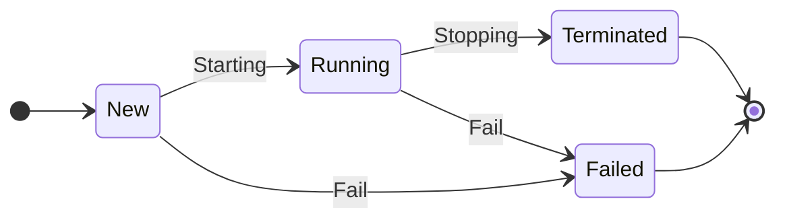
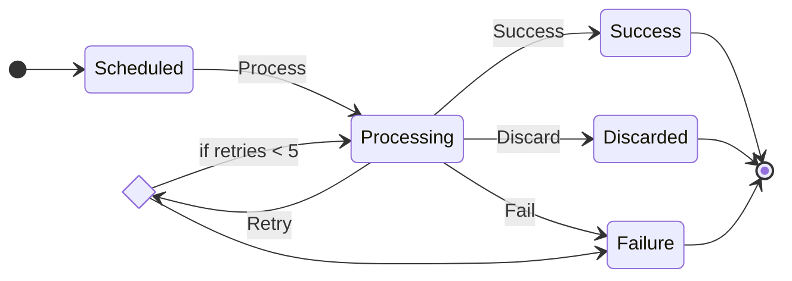

```mermaid
stateDiagram-v2
    direction LR
    [*] --> New
    New --> Running: Starting
    New --> Failed: Fail
    Running -->Terminated: Stopping
    Running --> Failed: Fail
    Terminated  --> [*]
    Failed --> [*]
```

```mermaid
stateDiagram-v2
    direction LR

    state should_retry <<choice>>

    [*] --> Scheduled
    Scheduled --> Processing: Process
    Processing --> Discarded: Discard
    Processing --> Success: Success
    Processing --> should_retry: Retry
    Processing --> Failure: Fail

    
    should_retry --> Processing : if retries < 5
    should_retry --> Failure


    Success --> [*]
    Discarded --> [*]
    Failure --> [*]
```
